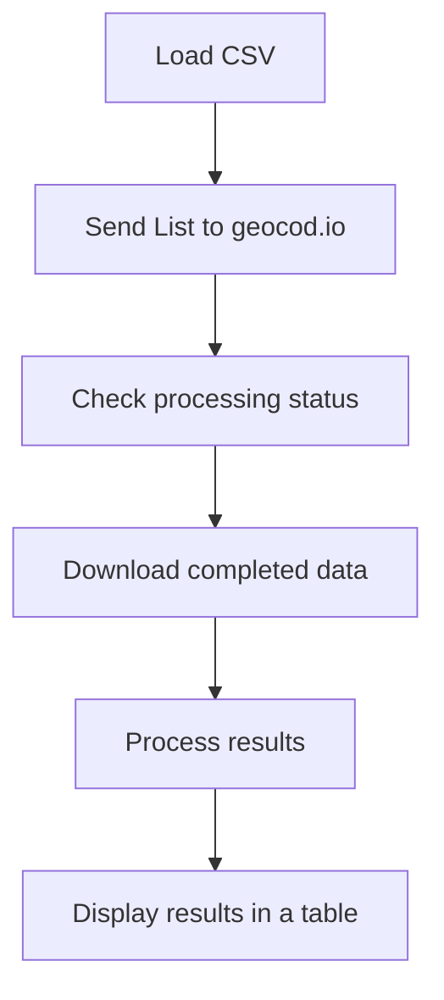

# Geocode Test App

*A client-side JS app for testing geocod.io API functionality and automation with Cypress.*

See it in action at https://lenoradev.com (temporary production environment).

## Flow


*Pro tip: All of the JS code in index.html is very well-commented!*

## geocod.io API Key

For demonstration purposes, the app is set to use an API key belonging to Lenora Chase.

The API key **can** be set at runtime by the user. Your geocod.io API key needs to have the POST and GET permissions enabled for the LISTS endpoint.

If you manually set the API key, it *should* persist through page refreshes, although that isn't guaranteed since it is based on your browser's handling of form input caching. If you do not want to manually set the key for every app instance, simply edit the index.html file and locate the geoAPIKey input on line #31. Then, replace the value with your own key and the app will default to using it instead.

In your browser's developer console, use the following command to manually set an API key:
```
setGeoAPIKey(api_key)
```

This is an exposed function so it can be called from tests as well.

## App Debug Mode

Debug mode will provide verbose status messages and payload data in the browser's console after API calls and other functions have been executed. Any errors will be routed to the console as well. When debug mode is disabled, errors will be displayed using alerts instead.

When the **Get List Status** button is clicked, the app will check a hidden input field for the flag that is set upload HTML load/reload. This flag is usually set to 1. 

Debug mode can be changed at *any time* by calling these functions from the browser's console. If you manually enable/disable debugging, then that setting will persist through page reloads. Otherwise, the default setting will follow what is set in the hidden input.

```
enableDebuggingMode();
```
and
```
disableDebuggingMode();
```

Regardless of whether debug mode is enabled or not, you can have the app dump its full appData configuration object and address collection data into the console at any time by calling this function:
```
displayAppData();
```

----

### Step 1. Load addresses from CSV and send to geocod.io


Start with a .csv containing some locations to check. The csv must comma-delimited, without any of the fields wrapped in quotes. Quotes will not be stripped from the data and will cause problems with the data that is returned from geocod.io. Do not include a header row, only the addresses to be looked up.

Use this format for your CSV file:
```
Label,Address 1,Address 2,City,State,Zip
```

| Field | Description |
|-------|-------------|
| Label | This is a nickname for the location, such as **Home** or **Work**. This field is optional and may be left blank. |
| Address 1 | This is a combination of street name and number, ie **123 Anywhere St.** or **3129 S. Douglas Fir Drive**. |
| Address 2 | Suites, office numbers, spaces, and apartment numbers are optional and do not affect geocoding. |
| City | The city name must be spelled out and not abbreviated. Use **Salt Lake City** instead of **SLC**. |
| State | Both the app and geocode.io expect a two-character abbreviated state, such as **NM** or **MD**. |
| Zip | At the very minimum, a standard zip/postal code must be supplied. Zip+4 codes are supported and optional. |

Example rows:
```
Home,123 Anywhere St.,,Nowheresville,CA,94123
,3129 S. Douglas Fir Drive,Ste 456,Salt Lake City,UT,84116
```
*Remember: Do **not** include a header row in your CSV file!*

Once you have browsed for and selected the file, you can then click the **Submit CSV Data and Send Request** button.

----

### Step 2. Wait for geocod.io to process data and fetch results


1. The app will process the CSV file and build its internal collection of addresses, preparing them to send to geocod.io.
2. The hidden **#appDebugMode** input will be checked. If its value == 1, the app's debug mode will be enabled (displaying a message in the footer).
3. If an API key has not been manually set through the console, the default key stored on line #31 of index.html file be used.
4. The app will call geocode.io's LISTS endpoint and supply all of the loaded addresses as a single list for processing. geocod.io will return a List ID.
5. These addresses will be displayed in a table for reference.

You can now click the **Get List Status and Display Results** button.

----

### Step 3. View geocoded address results


1. The LISTS endpoint is queried using the stored List ID to check on its processing status.
2. If processing has not yet completed, the button's text will be updated with the approximate remaining time, and can be clicked again.
3. When processing is complete, the app will download all of the processed results from geocod.io.
4. These results are then parsed, saving the new latitude/longitude/accuracy data into the original collection of addresses.
5. The final results table is then displayed. Geocoding errors (if any) will be marked with a red error icon in the Label column. This table also provides links to view the lat/lng coordinates in Google Maps.

If debug mode is enabled, the full appData object will be dumped to the console, allowing you to view config fields and each address record in its entirety.

----

### Dependencies

While the core logic is written in pure JS/HTML (no templating or frameworks), several libraries are used for enhnaced viewing and QoL improvements.

* **jQuery** - Used to simplify ajax calls/error handling, array iteration, and tidy up strings. The code can be refactored to omit its usage and would still work in the same way.
* **DataTables** - For prettier tables with extra functionality such as pagination, search, and column sorting. The app's code handles writing data to the tables before they are rendered by this library.
* **Modernizr** - This can be used to detect browser support for the native HTML 5 file input/upload control, and was added for this reason. However, the app is currently performing this check on its own to reduce dependencies for demonstration purposes.
* **FontAwesome** - Icons and button loading animations.
* **Google Fonts** - For the Roboto, Arial, sans-serif font family.

----

## Test Automation with Cypress.io


Eight tests were written and included in the repo. They can be found in **cypress/e2e**. Because this is a very simple application without much interaction, many of them are to ensure the app's exposed functions are working as expected.

The important test is **full_app_cycle.spec.cy.js** which tests the complete app cycle from start to finish, validating the geocod.io API calls in the process. In the real world, much more detailed assertions would be made against the data itself, not just the success of the API calls and data transfers.

### Configuring Cypress

To run these tests locally, there are a couple steps. The primary one, which you may already be familiar with, is installing Cypress and all of its dependencies locally. Node_modules is not included in the repository.

After cloning/downloading the repo to your local machine, navigate to the root project directory in a terminal window and execute:
```
npm install
```

Next, you will need to modify your local Cypress environment variables file. This is not something I would normally include in the repo because it stores the geocod.io api key and other tester-specific variables, so the contents of this file would be different for everyone. I have included it anyway to make everything a little more ready to go out of the box.

In the project root directory, open the cypress.env.json file. It will contain the following:
```
{
    "api_key": "your_api_key_goes_here_in_the_quotes",
    "test_url": "https://lenoradev.com",
    "csv_file": "test_addresses.csv",
    "expected_entries": 3,
    "list_wait_time": 5000
}
```
| Variable | Description |
|-------|-------------|
| api_key | Your geocod.io api key must have POST and GET permissions enabled for the LISTS endpoint. If you do not have a key, you can <a href="https://dash.geocod.io/apikey" target="_blank">get one here</a>. If you are in a hurry, you can *borrow* my key, which is already entered here. |
| test_url | This is the location of the app you are testing against. By default, it is set to use the temporary production environment I have set up at https://lenoradev.com. If you want to test the local project directory, just change it to a forward slash. |
| csv_file | This is the csv file containing the addresses to be used during testing. It is located in **cypress/fixtures**, and must follow the rules outlined at the top of this documentation. There is one included in this repo, which is the one set by default. |
| expected_entries | This is the number of rows/addresses you supply in the csv file. It might seem silly to put this number here when the app can (and will) tell you exactly how many rows there are, but Cypress does not scan the csv so you need to tell it how many you are expecting. This number **must** be greater than 1. If you put 0 or 1 in here, the test will fail. |
| list_wait_time | We want to give geocod.io enough time to process the list before querying the endpoint, because the test must make the assumption that it is ready for download, since we do not control their API and cannot handle varied wait times. Especially when we are dealing with milliseconds for just 2 or 3 addresses. |

### Running Tests

Now you are ready to run the tests! You can do that from the Cypress desktop app, or by using the following in your terminal:
```
npx cypress run
```

### App Output for Cypress

The reason each test puts the app into debug mode is because I have set up some Cypress Spies to monitor the app's internal debug and error messages.


The lines you see with the purple consoleLog labels are directly outputted from the app code. In a browser, these messages would be visible in the developer console. They can be useful when monitoring test execution.

There are several steps in the full cycle test where an assertion may fail (ie, after a button click), and the only way to identify the exact problem is from the specific error messages generated by the app itself. These will look very similar, but they will have a consoleError label instead. 

My goal was to add an afterEach assertion that causes the tests to fail any time a consoleError message appears. It is a little tricky getting Cypress to work nicely with console output, though, so this may have to wait until a little later.

Any time a consoleError is thrown, a test step is going to fail anyway. At least with the full cycle test.

----

## Manual Test Cases

To be safe, I made each test case fully independant of one another, in case they are not performed in order by the same tester. The CSV's used for each test case is different, with the final one showing us what happens when geocod.io fails to resolve an address.

### Test Case #1: CSV File Selection
This will make sure we can select a valid CSV file, and includes a bit of negative testing as well. 
| | Test Step | Test Data | Expected Result |
|---|---------|-----------|-----------------|
| 1 | Load the app in your browser | | The application loads and displays properly, without any console errors. |
| 2 | Click the **"Submit CSV Data and Send Request"** button without having selected a CSV file | | If debug mode is enabled, a "Please upload a valid CSV file" message is displayed in the console. Otherwise this will be shown as an alert. The button's text changes to an error message and asks you to try again. |
| 3 | Use the file control to browse for and select the supplied blank.csv file | Download and use <a href="_blank" href="https://lenoradev.com/cypress/fixtures/blank.csv">blank.csv</a> | The file input displays the name of blank.csv |
| 4 | Click the **"Submit CSV Data and Send Request"** button | | In debug mode, a "No addresses were imported" error will display in the console. Otherwise it will be shown as an alert.|
| 5 | Refresh the page | | The application reloads to its default state and the file input control shows "No file selected." |
| 6 | Use the file control to browse for and select the supplied test_addresses.csv file | Download and use <a href="_blank" href="https://lenoradev.com/cypress/fixtures/test_addresses.csv">test_addresses.csv</a> | The file input displays the name of test_addresses.csv |

### Test Case #2: Send Address List to geocod.io
Debug mode (Step 3) is optional, but it will show additional errors in the console if something goes wrong.
| | Test Step | Test Data | Expected Result |
|---|---------|-----------|-----------------|
| 1 | Load the app in your browser | | The application loads and displays properly, without any console errors. |
| 2 | Open the browser's developer tools and go to the console tab | F12 | The console is open and there is a line at the bottom where commands can be entered. |
| 3 | In the console, type **enableDubuggingMode()** and press Enter | | "Debugging mode enabled" will display in the console, and an additional indication of that will be appended to the footer. |
| 4 | In the console, type **setGeoAPIKey("your_api_key")**. Leave the quotes, and replace *your_api_key* with a geocod.io API key that has POST/GET perms for LISTS. Press Enter. | You may use Lenora's API key on line #31 of index.html, while it remains active. | "New geocod.io API key has been set" will display in the console. |
| 5 | Use the file control to browse for and select the supplied test_addresses.csv file | Download and use <a href="_blank" href="https://lenoradev.com/cypress/fixtures/test_addresses.csv">test_addresses.csv</a> | The file input displays the name of test_addresses.csv |
| 6 | Click the **"Submit CSV Data and Send Request"** button | | The button will briefly display "Working..." with a loading animation, before the view changes. |
| 7 | Confirm the elements of this new view | Below the app title should be a line that starts with "Step 2." A table with three addresses should be displayed in the center. Below that should be a button with the text, **"Get List Status and Display Results"** | These three elements should be visible and displayed correctly. |
| 8 | Verify that the labels and addresses match what is in test_addresses.csv | | The table is displaying correct information. |

### Test Case #3: Verify Completed Results from geocod.io
Debug mode (Step 3) is optional, but it will show additional errors in the console if something goes wrong.
| | Test Step | Test Data | Expected Result |
|---|---------|-----------|-----------------|
| 1 | Load the app in your browser | | The application loads and displays properly, without any console errors. |
| 2 | Open the browser's developer tools and go to the console tab | F12 | The console is open and there is a line at the bottom where commands can be entered. |
| 3 | In the console, type **enableDubuggingMode()** and press Enter | | "Debugging mode enabled" will display in the console, and an additional indication of that will be appended to the footer. |
| 4 | In the console, type **setGeoAPIKey("your_api_key")**. Leave the quotes, and replace *your_api_key* with a geocod.io API key that has POST/GET perms for LISTS. Press Enter. | You may use Lenora's API key on line #31 of index.html, while it remains active. | "New geocod.io API key has been set" will display in the console. |
| 5 | Use the file control to browse for and select the supplied more_addresses.csv file | Download and use <a href="_blank" href="https://lenoradev.com/cypress/fixtures/more_addresses.csv">more_addresses.csv</a> | The file input displays the name of more_addresses.csv |
| 6 | Click the **"Submit CSV Data and Send Request"** button | | The button will briefly display "Working..." with a loading animation, before the view changes. |
| 7 | Confirm the elements of this new view | Below the app title should be a line that starts with "Step 2." A table with five addresses should be displayed in the center. Below that should be a button with the text, **"Get List Status and Display Results"** | These three elements should be visible and displayed correctly. |
| 8 | Verify that the labels and addresses match what is in more_addresses.csv | | The table is displaying correct information. |
| 9 | Click the **"Get List Status and Display Results"** button | | The button will briefly display "Working..." with a loading animation, before the view changes again. |
| 10 | Confirm the elements of this new view | Below the app title should be a line that starts with "Step 3." A table with five addresses should be displayed in the center. | These two elements should be visible and displayed correctly. |
| 11 | Verify that the labels and addresses match what is in more_addresses.csv | | The table is displaying correct information. |
| 12 | Verify that latitude, longitude, accuracy, and link buttons appear for every row except "Hillcrest Park Zoo" | | These columns all contain data except for "Hillcrest Park Zoo" |
| 13 | Hover over the red error icon next to "Hillcrest Park Zoo" | | A tooltip appears and reads, "geocod.io was not able to geocode this address." |
| 14 | Click one of the View buttons for a resolved address | | Google Maps opens in a tab with a map marker in the correct location.

That concludes the documentation in this README. Please let me know if you have any questions or would like any clarifications or detailed explanations on anything presented here.

The temporary production environment and my personal API key will remain active for at least another several weeks, and this repo will be updated again once those are no longer available.

----

*Geocode Test App created by Lenora Chase on Jan 20th, 2023. Cypress test suite added Jan 21st.*